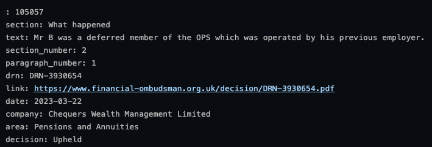

# lbg-hackathon-8
lbg-hackathon-8

A simple persist vector store with sentence transformer embeddings and Chroma.

You can query by similarity search.

Example:
Query - What happened to Mr. B?
Top search result:



For stream-lit pip install the following:

`pip install -qq langchain wget llama-index cohere llama-cpp-python llama-index-llms-llama-cpp`

and then to download the model:

```python 
import wget 

def bar_custom(current, total, width=80):
    print("Downloading %d%% [%d / %d] bytes" % (current / total * 100, current, total))

model_url = "https://huggingface.co/TheBloke/Llama-2-7B-Chat-GGUF/resolve/main/llama-2-7b-chat.Q2_K.gguf"
wget.download(model_url, bar=bar_custom)
```